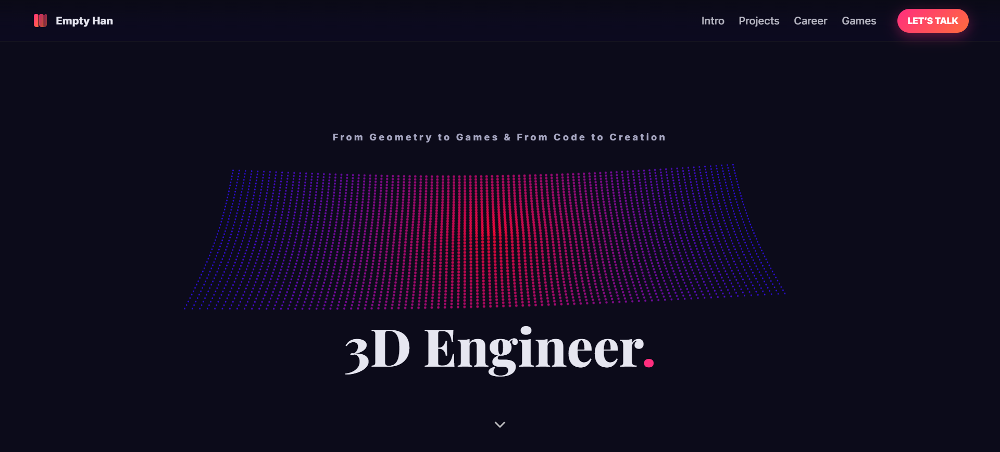

# Personal Interactive 3D Portfolio Website


This repository contains the source code for my interactive **portfolio website** that integrates **real-time 3D rendering**, **custom shaders**, and **responsive UI design**.  The site demonstrates technical proficiency in graphics programming, modern frontend frameworks, and interactive visualization.

[](https://bangbiu.github.io/EmptyHundred/)

## Features

- **3D Scene Integration**
  - Modular scene system built on Three.js with a reusable `SceneBuilder` base class.
  - ACES Filmic Tone Mapping and sRGB color management for photorealistic rendering.
  - PCF Soft Shadows with adjustable bias and radius for artifact-free, softened edges.

- **Procedural Background Animation**
  - GPU-driven grid surface (`Grids.ts`) with sinusoidal wave displacement.
  - Per-vertex phase offset computation for non-uniform oscillation.
  - Additive blending and circular point rendering for glowing grid dots.

- **Interactive Rank Visualization**
  - Overwatch-inspired emblem podiums (`Ranks.ts`) with custom materials and lighting.
  - Multi-source lighting setup: ambient light + dual overhead spotlights.
  - Real-time object animation (hover, rotation oscillation).
  - Sparkle particle field with **superellipse-based distribution**.

- **Spring-Based Interaction**
  - Custom `SpringDrag` controller implements a damped spring-mass system.
  - Maps pointer drag input to rotational displacement using soft-saturation (`tanh` mapping).
  - Provides natural resistance and smooth return-to-default rotation.

- **User Interface**
  - Section reveal animation via IntersectionObserver.
  - Biography, Projects, and Career sections styled with gradient layers and neon glows.
  - Game Play section with normalized progress bars and Steam integration.
  - Contact section with consistent card-based design and external profile links.


## Tech Stack

| Category              | Technologies |
|-----------------------|--------------|
| **Languages**         | TypeScript, HTML5, CSS3 |
| **Frameworks/Build**  | Vite, ES Modules |
| **3D Engine**         | Three.js |
| **Shaders**           | GLSL ES 3.0 (custom vertex and fragment pipelines) |
| **Styling**           | CSS3 with gradients, flexbox, grid, backdrop filters |
| **Icons**             | Devicon |
| **Fonts**             | Inter, Playfair Display |


## Technical Details

### `SceneBuilder.ts`
- Initializes reusable rendering pipeline:
  - **ACES Filmic Tone Mapping** for HDR tone reproduction.
  - **sRGB color space** enforcement for consistent gamma correction.
  - **Resize observer** for dynamic aspect ratio correction.
  - **IntersectionObserver** for conditional animation loop execution.

### `Grids.ts`
- Constructs GPU-driven point grid:
  - Vertex shader displaces vertices via `sin(phase + uTime) * amplitude`.
  - Phase values precomputed based on radial distance for wave diversity.
  - Fragment shader renders circular points with smooth alpha blending.
  - Camera auto-oscillation (sinusoidal motion on X and Y axes).

### `Ranks.ts`
- Implements interactive emblem podiums:
  - **Geometry**: Cylinder podium mesh with shadow projection via transparent circle geometry.
  - **Lighting**: Dual spotlight configuration with shadow bias correction and radius blur for Soft Shadows.
  - **Animation**: Hover effect via sinusoidal vertical displacement; micro-rotation on Y-axis.
  - **Camera Transition**: Smooth quaternion slerp toward target role podium.
  - **UI Binding**: Role switch buttons bound to focus control.

### `SpringDrag.ts`
- Defines spring-mass system for drag interaction:
  - Governing equation:  
    ```
    θ'' = -k(θ - θ_target) - cθ'
    ```
    where *k* is stiffness, *c* is damping.
  - Drag distance mapped to `θ_target` via `tanh(dx * gain * pixelScale)`.
  - Produces bounded angle deviation and natural spring return.


## Development Environment and Dependencies

- **Runtime Environment**: Node.js ≥ 18
- **Package Manager**: npm (or yarn/pnpm)
- **Core Dependencies**:
  - `three` → rendering engine
  - `vite` → build system and dev server
- **Dev Dependencies**:
  - TypeScript compiler
  - ESLint / Prettier (recommended for code consistency)

## Setup
```bash
# Clone the repository
git clone https://github.com/Bangbiu/EmptyHundred.git
cd EmptyHundred

# Install dependencies
npm install

# Start development server
npm run dev

# Build production output
npm run build
```

## Acknowledgements

- **Three.js** — Core rendering engine and scene graph system.  
- **Devicon** — Technology icons integrated into the skill set section.  
- **Meshy.AI** — 3D emblem models are generated and powered by Meshy.AI.  
- **Google Fonts** — Inter and Playfair Display typography used for consistent branding.  

## License
MIT
